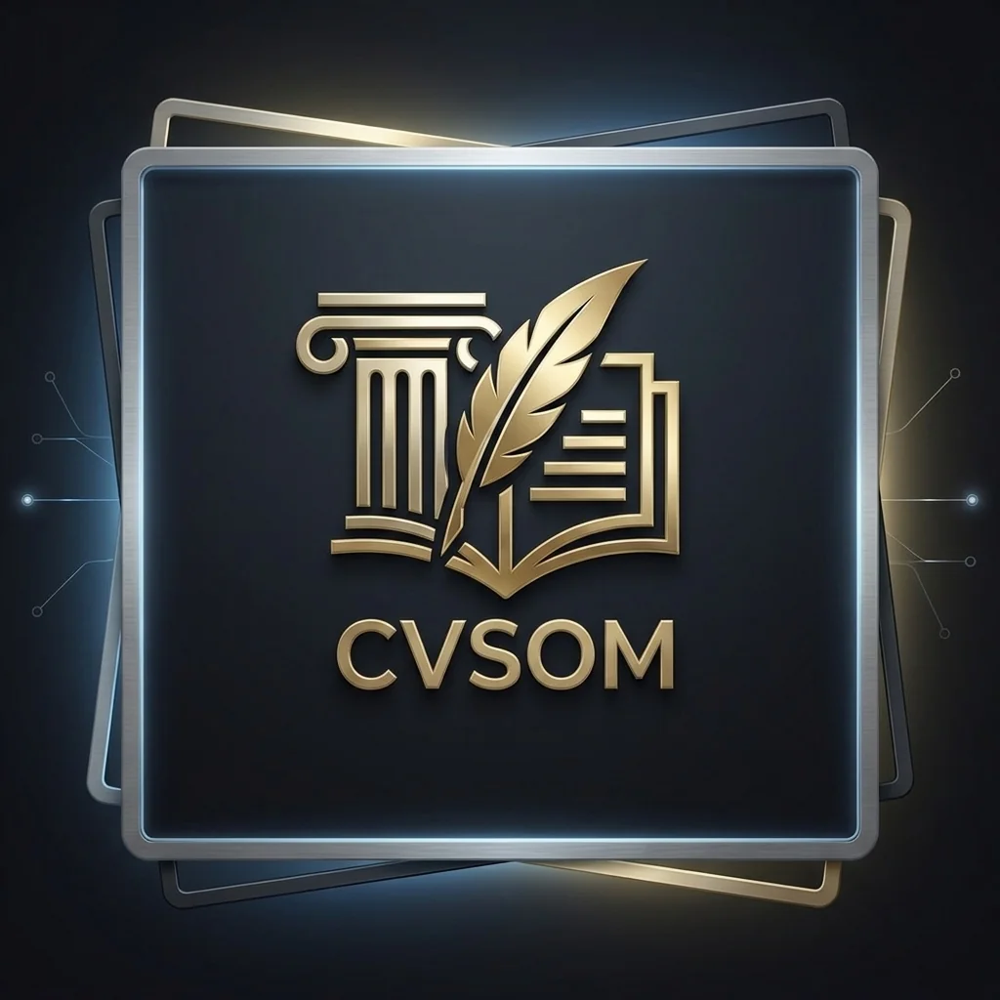

# 🏆 CVSOM — Yale SOM & Harvard Elite Standard CV Builder

> **Yale SOM CDO, Harvard Business School ve Google XYZ standartlarında ATS-dostu CV oluşturma platformu. 7 AI destekli modül. Sıfır sunucu. Tamamen tarayıcıda çalışır.**

[](LICENSE)
[](https://som.yale.edu)
[](https://hbs.edu)
[](https://re.work)
[](.)



---

## 🎯 Nedir?

CVSOM; Yale SOM Career Development Office rehberi, Harvard Business School eylem fiili standartları ve Google'ın XYZ etki formülüne bağlı, gerçek akademik metodoloji kullanan bir CV üretici ve kariyer asistanıdır.

**Verileriniz hiçbir zaman sunucuya gitmez.** Tüm işlemler `localStorage` ve tarayıcı belleğinde gerçekleşir.

---

## ✨ 7 AI Modülü

### 1. 📊 Canlı ATS Skorer (Yale SOM CDO / HBS / Google XYZ)
CV bullet point'lerinizi gerçek zamanlı olarak puanlar.

| Kriter | Ağırlık |
|---|---|
| İletişim bilgileri | 20 puan |
| Profesyonel özet | 15 puan |
| Deneyim (action verb + metrik) | 30 puan |
| Eğitim | 15 puan |
| Yetenekler | 20 puan |

- HBS onaylı eylem fiillerini (Led, Spearheaded, Architected...) tanır
- Google XYZ formülünü (Accomplished X, measured by Y, by doing Z) puanlar
- Edge-case koruması: boş input, sadece rakam, özel karakter engellenir
- `Enter` tuşuyla anında hesaplama

### 2. ✍️ Akıllı Bullet Point Yeniden Yazıcı
Sıradan iş deneyimi cümlelerini 3 farklı Yale SOM/HBS formatına dönüştürür:

| Tier | Odak | Örnek Fiil |
|---|---|---|
| 👑 Liderlik | Ekip yönetimi, strateji | Led, Spearheaded, Championed |
| 📈 Etki & Metrik | Sayısal sonuç (Google XYZ) | Drove, Generated, Accelerated |
| 🛠️ Teknik | Araçlar, mimari | Architected, Automated, Deployed |

### 3. 🎯 İlan Metni Uyumluluk Analisti (JD Matcher)
Greenhouse ve Lever ATS botlarını simüle eder:
- İlandaki en kritik 10 anahtar kelimeyi çıkarır
- CV'nizle karşılaştırır → %0–100 Job Match Score
- Eksik kelimeleri Yale SOM standardında CV'ye nasıl yerleştireceğinizi önerir

### 4. ✉️ Cover Letter Generator (Yale SOM Executive Format)
4 alan (ad, şirket, güçlü yön, neden bu şirket) ile kişiselleştirilmiş, kurumsal ön yazı üretir:
- Yale SOM CAR (Context-Action-Result) çerçevesi
- Basma kalıp açılış cümleleri yok
- TR/EN tam dil desteği, otomatik tarih

### 5. 🗺️ Career Gap Advisor
Mevcut rol ile hedef pozisyon arasındaki açığı analiz eder:

| Kart | İçerik |
|---|---|
| 🎓 Eksik Sertifikalar | CPM, AWS, PMP, CKAD vs. |
| 🛠️ Geliştirilmesi Gereken Yetkinlikler | MECE, OKR, A/B test vs. |
| 🗣️ Sektörel Jargon | North Star Metric, ETL Pipeline vs. |

5 kariyer alanı: Product, Data, Consulting, Software, General

### 6. 📝 CV Editörü (editor.html)
- Harvard/Yale formatında tek sayfa CV üretimi
- Canlı A4 önizleme
- AutoFit: içerik ne kadar uzun olursa olsun 1 sayfaya sığdırır
- PDF.js ile mevcut CV yükleme ve otomatik ayrıştırma
- TR/EN şablon seçimi

### 7. 🌐 TR/EN Tam i18n Desteği
Tüm arayüz, modül çıktıları, placeholder'lar ve hata mesajları dil geçişiyle anında güncellenir.

---

## 🛠️ Teknoloji Yığını

| Katman | Teknoloji |
|---|---|
| Frontend | Vanilla HTML5, CSS3, JavaScript ES6+ |
| PDF Parser | Mozilla PDF.js |
| Design System | CSS Custom Properties, Glassmorphism |
| Depolama | localStorage API (hiçbir sunucu yok) |
| ATS Engine | HBS Action Verbs + Yale SOM CDO + Google XYZ (custom JS) |
| Testler | Jest (unit) — Playwright (E2E — geliyor) |

---

## 🚀 Hızlı Başlangıç

### 1. Klonla
```bash
git clone https://github.com/AsilDogukanSamay/harvard-cv-builder.git
cd harvard-cv-builder
```

### 2. Yerel sunucu başlat
```bash
python -m http.server 3000
```

### 3. Aç
| Sayfa | URL |
|---|---|
| **Landing (Tüm Modüller)** | `http://localhost:3000/index.html` |
| **CV Editörü** | `http://localhost:3000/editor.html` |
| **Giriş** | `http://localhost:3000/login.html` |

---

## 📁 Proje Yapısı

```
CVSOM/
├── .agent/                     # AI Agent skill dosyaları (5 skill)
│   ├── 01-qa-ats-validator.md
│   ├── 02-ui-ux-specialist.md
│   ├── 03-bullet-rewriter.md
│   ├── 04-jd-matcher.md
│   └── 05-cover-letter-advisor.md
├── tests/
│   ├── ats.test.js             # Jest unit testleri
│   ├── career-gap.test.js      # Career Gap Advisor testleri
│   ├── cover-letter.test.js    # Cover Letter Generator testleri
│   └── i18n.test.js            # TR/EN dil geçişi testleri
├── index.html                  # Landing + tüm 7 modül
├── editor.html                 # CV editörü
├── landing.css                 # Design system
├── style.css                   # Editor stilleri
├── app.js                      # CV state & editor logic (202KB)
├── cvsom_logo.webp             # Optimize edilmiş logo (41KB, WebP)
└── README.md
```

---

## 🧪 Testler

```bash
# Bağımlılıkları yükle
npm install

# Unit testleri çalıştır
npm test

# Belirli test dosyası
npx jest tests/ats.test.js --verbose
```

---

## 🔐 Güvenlik

- **Sıfır sunucu iletişimi:** CV veriniz tarayıcınızdan çıkmaz
- **XSS koruma:** `setLanguage()` tüm çevirilerde `textContent` kullanır; HTML işaretlemesi gereken anahtarlar beyaz liste ile kontrol edilir
- **Input validation:** Tüm modül girişlerinde edge-case koruması

---

## 📐 ATS Referans Metodolojisi

> Bu uygulama; Yale SOM CDO rehberi, HBS Eylem Fiili Standartları ve Google XYZ etki formülü esas alınarak geliştirilmiştir.

- [Yale SOM Career Development Office](https://som.yale.edu/facultyresearch/centers-initiatives/chief-executive-leadership-institute/careers)
- [Harvard Business School Resume Guide](https://www.hbs.edu/mba/student-life/career-professional-development)
- [Google re:Work — XYZ Formula](https://rework.withgoogle.com)

---

## 🗺️ Yol Haritası

### Tamamlanan ✅
- [x] ATS Skorer (Yale SOM / HBS / Google XYZ)
- [x] Bullet Point Yeniden Yazıcı (3 tier)
- [x] JD Matcher (Greenhouse & Lever simülasyonu)
- [x] Cover Letter Generator
- [x] Career Gap Advisor
- [x] TR/EN tam i18n desteği
- [x] Mobil responsive tasarım
- [x] XSS güvenlik sertleştirmesi

### Geliyor 🔜
- [ ] Playwright E2E test paketi
- [ ] CV Karşılaştırıcı (diff görünümü)
- [ ] Sektör Benchmark paneli
- [ ] Supabase Auth + bulut senkronizasyonu
- [ ] Freemium SaaS modeli

---

## 👨‍💻 Geliştirici

**Asil Doğukan Samay**
- 💼 Management Information Systems (MIS) Specialist | Business & Data Analyst
- 🔗 [linkedin.com/in/asil-dogukan-samay](https://linkedin.com/in/asil-dogukan-samay)
- 🐙 [github.com/AsilDogukanSamay](https://github.com/AsilDogukanSamay)

---

## 📜 Lisans

MIT License © 2026 Asil Doğukan Samay
